<hr style="border: 0; height: 3px; background: linear-gradient(to right, #3498db, #9b59b6, #e74c3c); margin: 20px 0;">

<div align="center">

# Autonomous AI-Driven DevSecOps Remediation Engine

**AST-Guarded Self-Healing Pipeline for Trivy & Checkov Vulnerabilities**

[](https://github.com/)
[](https://github.com/cbrkrtek/ai-devsecops-auto-remediation/stargazers)
[](https://github.com/cbrkrtek/ai-devsecops-auto-remediation/blob/main/LICENSE)
[](https://www.docker.com/)
[](https://github.com/aquasecurity/trivy)

<p align="center">
  This project bridges the gap between vulnerability detection and instant mitigation. It intercepts security scan reports, analyzes the code context using localized LLMs, and safely commits precise, verified fixes—eliminating alert fatigue.
</p>

---
[The Problem](#the-problem--the-shift) • [Features](#-key-features) • [Quick Start](#-quick-start-local-installation) • [Demo](#how-it-looks-cli-demo) • [Architecture](#%EF%B8%8F-architecture-flow) • [Benchmarks](#-enterprise-readiness) • [Roadmap](#️-strategic-roadmap)

</div>

<hr style="border: 0; height: 3px; background: linear-gradient(to right, #3498db, #9b59b6, #e74c3c); margin: 20px 0;">


## The Problem & The Shift

Traditional DevSecOps scanners (**Trivy, Checkov**) are great at *finding* flaws but terrible at *fixing* them. Security teams are overwhelmed by **Alert Fatigue**, while developers waste thousands of engineering hours manually bumping Docker base images and rewriting manifests.

> **The Philosophy:** Shift-Left is dead if it only means shifting the blame to developers. This engine introduces **Autonomous Remediation**—don't just scan it, heal it.

---

## ⚡ Key Features

* **AST-Guarded Integrity:** Unlike naive AI wrappers, this engine is designed to parse your source manifests into an **Abstract Syntax Tree (AST)** before and after modification, mathematically guaranteeing no AI hallucinations enter your codebase.
* **Multi-Scanner Ingestion:** Native, high-performance parsers for `Trivy` (Container Images) and `Checkov` (Infrastructure-as-Code).
* **Local-First AI Execution:** 100% data privacy. Works entirely offline with localized LLMs via `Ollama` (**Qwen2.5-Coder:7b**), ensuring zero code telemetry leaks to public cloud APIs.
* **GitOps Native:** Deploys as a lightweight GitHub Action or a standalone CLI tool, spawning automated, clean fixes.

---

## 🚀 Quick Start (Local Installation)

Follow these steps to set up and run the remediation engine entirely on your local machine:

### 1. Install Prerequisites
Make sure you have the following security tools and environment packages installed locally:
* **Trivy CLI:** Follow the [Official Trivy Installation Guide](https://aquasecurity.github.io/trivy/v0.18.3/getting-started/installation/) for your OS.
* **Ollama:** Download and install it from [Ollama Official Website](https://ollama.com/).

### 2. Download and Run the Local LLM
Pull the state-of-the-art model optimized for code and infrastructure refactoring. Open your terminal and run:
```bash
ollama run qwen2.5-coder:7b
```
*(Once the download finishes, you can exit the interactive chat by typing /bye. The Ollama daemon will continue running seamlessly in the background).*

### 3. Clone and Run the Application
Clone this repository to your local workspace, make sure your target `Dockerfile` is placed inside the root directory, and run the core script:
```
# Clone the repository
git clone [https://github.com/cbrkrtek/ai-devsecops-auto-remediation.git](https://github.com/cbrkrtek/ai-devsecops-auto-remediation.git)
cd ai-devsecops-auto-remediation

# Trigger the orchestrator pipeline
python main.py
```
## How It Looks (CLI Demo)
When you launch the pipeline, it coordinates the local tools and outputs the following execution lifecycle:  
```
$ python main.py
START
Found files: 1
Directory to store fixed files: fixed

ANALYSE: vulnerable.Dockerfile
------------------------------------------------------------
Scanning file: vulnerable.Dockerfile...
Report has created successfully trivy_report_vulnerable.Dockerfile.json
Secure file has written in fixed/vulnerable.Dockerfile
```

## 🏗️ Architecture Flow

```mermaid
graph LR
    A[📦 Local Workspace / PR] -->|Original Source Code| B[🔥 Remediation Core]
    A -->|Original Source Code| D[📊 AST Syntax Parser]
    B --> C[🔍 Scanner Ingestion: Local Trivy Scan]
    C -->|Raw JSON Telemetry| D
    D -->|Contextual Code Tree + Findings| E[🧠 Secure Local LLM: Qwen2.5-Coder]
    E -->|Generated Dockerfile Code| F[🧪 Build & Syntax Validator]
    F -->|Validation Fails| E
    F -->|Validation Passes| G[🚀 Hardened Manifest Applied]

    style B fill:#d6eaf8,stroke:#3498db,stroke-width:2px
    style E fill:#fdebd0,stroke:#e67e22,stroke-width:2px
    style G fill:#d4efdf,stroke:#27ae60,stroke-width:2px
```



## 📈 Enterprise Readiness

This engine is architected from day one to handle planet-scale infrastructure requirements:

| Capability | Standard Wrappers | Our Approach |
| :--- | :--- | :--- |
| **Data Privacy** | Sends private code to public APIs | **100% Air-Gapped** via Local LLM Mesh (Ollama) |
| **Model Optimization** | General-purpose models (GPT-4) | **Domain-Specific LLM Core** (Qwen2.5-Coder:7b) |
| **Safety** | Blindly copies LLM output | **Strict AST Verification** (Pre & Post checks) |
| **Execution Layer** | Single-threaded scripts | **Async Pipeline Orchestrator** |

---

## 🗺️ Strategic Roadmap (Detailed Monthly Execution Plan)

### 🟢 May 2026: Local Remediation Core & Initial AST Groundwork (Current Sprint)
- [x] [cite_start]**Scanner Ingestion Engine:** Developed a native Python orchestrator to trigger local Trivy scans and parse raw JSON vulnerability telemetry[cite: 1].
- [x] **Local LLM Orchestration:** Integrated execution pipeline with **Qwen2.5-Coder:7b** via Ollama API for 100% air-gapped data privacy.
- [x] **Rule-Based Hardening:** Implemented deterministic DevSecOps prompt constraints to enforce non-root user creation and package manager layer pruning.
- [ ] **Dockerfile AST Structural Mapping:** Writing a dedicated Python-based concrete syntax parser to break down Dockerfile instructions (`FROM`, `RUN`, `USER`, `HEALTHCHECK`) into a predictable, queryable tree architecture.
- [ ] **State Comparison Engine:** Architecting the core module that hooks into the pipeline to compare the AST structural changes *before* and *after* the LLM refactoring, preventing arbitrary script injections.
- [ ] **Local Verification Pipeline Integration:** Consolidating the Trivy parser and the initial tree-validation hooks into a single automated local entrypoint (`main.py`) to prepare for cloud execution.

### 🟢 June 2026: CI/CD Pipeline Embedding & Automated Feedback Loop
- [ ] **In-Pipeline AST Construction:** Embedding the engine into CI/CD environments (GitHub Actions / GitLab CI) to map abstract syntax trees of infrastructure code directly on code commits.
- [ ] **Iterative Generation Loop:** Developing a closed-loop feedback mechanism where the LLM continuously re-generates the Dockerfile if the AST parser detects syntax or security anomalies during the build phase.
- [ ] **Convergence Engine:** Implementing recursive prompt self-correction, passing AST structural errors and validation failure logs back to the local LLM until a mathematically optimal and compliant syntax tree is accomplished.

### 🟢 July 2026: AST Parser Optimization & Multi-Distro Validation
- [ ] **Advanced Dockerfile AST Mapping:** Upgrading the parser to support multi-stage builds and complex instructions, ensuring the agent maintains functional parity across multi-layered manifests.
- [ ] **Cross-Distribution Package Management:** Expanding AST validation rules to support diverse OS package managers (Debian/Ubuntu `apt`, Alpine `apk`, RHEL/CentOS `dnf`) to avoid environment-specific generation breakdown.
- [ ] **Local Build Simulation:** Integrating automated dry-run container builds within the pipeline execution layer to double-verify AST compliance before code serialization.

### 🟢 August 2026: Infrastructure-as-Code (IaC) Expansion
- [ ] **Checkov & Terrascan Ingestion:** Developing telemetry parsers for IaC misconfiguration scanners to extract static cloud vulnerabilities.
- [ ] **Terraform AST Engineering:** Building an HCL (HashiCorp Configuration Language) abstract syntax tree mapper to allow the engine to analyze and isolate cloud resource declaration blocks.
- [ ] **Recursive Cloud Manifest Repair:** Applying the iterative feedback loop to safely patch cloud storage access controls, IAM privileges, and network security groups.

### 🟢 September 2026: Context-Aware Security Policies (Local RAG)
- [ ] **Enterprise Policy Ingestion:** Integrating a local vector database (ChromaDB / FAISS) to store custom enterprise security baselines and internal corporate compliance documentation.
- [ ] **Retrieval-Augmented Prompting:** Injecting relevant enterprise security rules directly into the LLM context window during the AST evaluation phase.
- [ ] **Custom Guardrail Enforcement:** Restricting the AI agent from proposing modifications that violate internal network architectures or approved corporate base-image registries.

### 🟢 Q4 2026 and Beyond: Distributed Architecture & Runtime Feedback
- [ ] **Enterprise GitOps App:** Packaging the framework into a cloud-native, scalable GitHub App utilizing secure webhook trigger architectures and distributed worker queues (Celery/Redis).
- [ ] **eBPF-to-Source Self-Healing:** Integrating live cloud runtime anomaly data (via Falco or Cilium) directly back to the static repository layer, allowing runtime threats to trigger automated AST-guided code-healing patches.

## 📄 License
Distributed under the Apache 2.0 License. See `LICENSE` for more information.

## ⚠️ Disclaimer
This project is an experimental, AI-driven automation tool. Autonomous code remediation carries inherent risks of code modification errors or syntax breakdown. **Always thoroughly review and test all AI-generated files in a staging/sandbox environment before deploying to production.** The author carries zero responsibility for infrastructure damage, security regressions, or production downtime.
