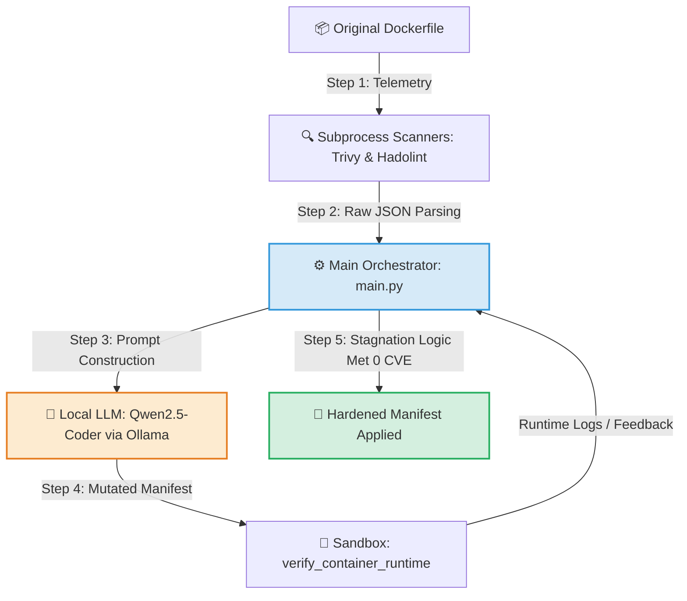

<hr style="border: 0; height: 3px; background: linear-gradient(to right, #3498db, #9b59b6, #e74c3c); margin: 20px 0;">

<div align="center">

# Autonomous AI-Driven DevSecOps Remediation Engine

**Hybrid Self-Healing Pipeline for Trivy & Hadolint using Localized LLMs**

[](https://github.com/cbrkrtek/ai-devsecops-auto-remediation/releases)[](https://www.docker.com/)
[](https://github.com/aquasecurity/trivy)

<p align="center">
  This project bridges the gap between vulnerability detection and instant mitigation. Built completely from scratch, it intercepts security scan reports, analyzes code context using local LLMs, and coordinates an iterative verification loop to safely patch manifests—eliminating alert fatigue without cloud leaks.
</p>

---
[The Problem](#the-problem--the-shift) • [Key Features](#-key-features) • [Quick Start](#-quick-start-local-installation) • [CLI Demo](#how-it-looks-real-world-cli-demo) • [Architecture](#%EF%B8%8F-architecture-flow) • [Enterprise Readiness](#-enterprise-readiness) • [Roadmap](#%EF%B8%8F-strategic-roadmap)

</div>

<hr style="border: 0; height: 3px; background: linear-gradient(to right, #3498db, #9b59b6, #e74c3c); margin: 20px 0;">


## The Problem & The Shift

Traditional DevSecOps scanners (**Trivy, Hadolint**) are great at *finding* flaws but terrible at *fixing* them. Security teams are overwhelmed by **Alert Fatigue**, while developers waste engineering hours manually bumping base images and rewriting manifests.

> **The Philosophy:** Shift-Left is dead if it only means shifting the blame to developers. This engine introduces an **Autonomous Remediation Framework** written from scratch—don't just scan it, heal it.

---

## ⚡ Key Features

* **Zero-Framework Orchestrator:** No bloated LLM wrappers (no LangChain, no CrewAI). Built fully from scratch in pure Python for absolute data provenance and execution speed.
* **Iterative Loop Control:** Implements a deterministic `while` loop mechanism protecting the pipeline from AI deadlocks and infinite generation cycles.
* **Local-First AI Execution:** 100% data privacy. Works entirely offline with localized LLMs via `Ollama` (**Qwen2.5-Coder:7b**), ensuring zero code telemetry leaks to public cloud APIs.
* **Runtime Verification & Stagnation Tracking:** Spawns automated container dry-runs in an isolated sandbox, analyzing runtime logs against static security scan differentials.

---

## 🚀 Quick Start (Local Installation)

### 1. Install Prerequisites
Make sure you have the following security tools and environment packages installed locally:
* **Trivy CLI:** Install the official [Trivy Scan Tool](https://aquasecurity.github.io/trivy/).
* **Hadolint:** Container linter tool.
* **Ollama:** Download and install it from [Ollama Official Website](https://ollama.com/).

### 2. Run the Local LLM
Pull the state-of-the-art model optimized for code and infrastructure refactoring:
```bash
ollama run qwen2.5-coder:7b
```

### 3. Clone and Run the Application
Clone this repository, place your target `vulnerable.Dockerfile` inside the root directory, and trigger the execution core:

```
git clone [https://github.com/cbrkrtek/ai-devsecops-auto-remediation.git](https://github.com/cbrkrtek/ai-devsecops-auto-remediation.git)
cd ai-devsecops-auto-remediation

# Trigger the orchestrator pipeline
python main.py
```

## 💻 How It Looks (Real-World CLI Demo)

Here is the actual execution log of the framework. It showcases the closed-loop engine processing a `Dockerfile`, dynamically resolving security vulnerabilities and linter alerts step-by-step, and breaking the loop safely via the **Stagnation Guardrail**:
```
PS D:\my-project-ai> python main.py
===============================================================
🔄 STARTING: Universal Autonomous Self-Healing Pipeline (While-Loop Guarded)
===============================================================

🎯 TARGET FILE: vulnerable.Dockerfile
  🌀 Loop Step #1...
  🛡️  Current issues: 4 (Trivy: 2, Linter: 2)
     👉 Target issues IDs to fix: ['DS-0002', 'DS-0029', 'DL3002', 'DL3008']
  🧪 Running sandbox runtime execution test...
  🌀 Loop Step #2...
  🛡️  Current issues: 1 (Trivy: 0, Linter: 1)
     👉 Target issues IDs to fix: ['DL3008']
  🧪 Running sandbox runtime execution test...
  🌀 Loop Step #3...
  🛡️  Current issues: 0 (Trivy: 0, Linter: 0)
  🧪 Running sandbox runtime execution test...
  🌀 Loop Step #4...
  🛡️  Current issues: 0 (Trivy: 0, Linter: 0)
  🧪 Running sandbox runtime execution test...
  🌀 Loop Step #5...
  🛡️  Current issues: 0 (Trivy: 0, Linter: 0)
  ⚠️ Stagnation detected (Issues count stalled at 0).
  🎉 Security and Linting goals achieved! Accepting final state despite runtime container warnings.
✅ Processing vulnerable.Dockerfile finished with status: SUCCESS
```

## 🏗️ Architecture Flow
The workflow relies on a strict hybrid verification cycle where the Python core acts as a rigid barrier, controlling the flexible nature of the local LLM:


## 📈 Enterprise Readiness

| Capability | Standard AI Wrappers | Our Framework Approach |
| :--- | :--- | :--- |
| **Data Privacy** | Sends private infrastructure code to public cloud APIs | **100% Air-Gapped** via Local LLM Mesh (Ollama) |
| **Orchestration Layer** | Heavy third-party frameworks (LangChain/CrewAI) | **Zero-Dependency Core** written completely from scratch |
| **Execution Loop** | Blindly trusts the first output or gets stuck | **Strict `while` Limit Guardrails** with stagnation counters |
| **Verification** | Assumes the code is valid if syntax looks right | **Two-Tier Validation** (Static JSON Differential + Sandbox Runtime) |

---

## 🗺️ Strategic Roadmap

### 🟢 May 2026: Local Remediation Core & Pipeline Foundations (Current Sprint)
- [x] **Greenfield Architecture:** Designed and coded the main orchestrator (`main.py`, `scanner.py`, `client.py`) entirely from scratch.
- [x] **Multi-Scanner Ingestion:** Integrated native subprocess execution for both **Trivy** (security) and **Hadolint** (linting).
- [x] **Local LLM Orchestration:** Established low-overhead API hooks into **Qwen2.5-Coder:7b** via Ollama.
- [x] **Stagnation-Based Loop Termination:** Implemented loop-breaking heuristics to intercept runtime deadlocks when models resolve 100% of static vulnerabilities but stall on runtime app logs.
- [x] **Sandbox Telemetry Isolation:** Built real-time container dry-run execution layers to check manifest build statuses.

### 🟡 June 2026: AST Integration & Heavy Model Scaling
- [ ] **Dockerfile AST Structural Mapping:** Integrating a Python concrete syntax parser to break down mutated instructions (`FROM`, `RUN`, `USER`) into an un-hallucinatable tree architecture.
- [ ] **State Comparison Engine:** Building a core module to compare the AST structures *before* and *after* refactoring to mathematically prevent arbitrary command injections.
- [ ] **Model Scale Expansion:** Transitioning the local inference core to specialized heavyweight models (**Qwen2.5-Coder-32B-Instruct** and **Llama-3.1-70B-Instruct**) to benchmark native systemic Linux reasoning.

### 🔵 Q3 2026: Multi-Distro Hardening & GitOps Native Deployment
- [ ] **Cross-Distribution Package Management:** Mapping AST validation rules to support diverse OS package managers (`apt`, `apk`, `dnf`) to prevent multi-layer package breakdown.
- [ ] **GitLab/GitHub Webhook Automation:** Packaging the engine into a lightweight GitOps application that automatically spawns remediation Pull Requests with embedded Markdown CVE tables on every new commit.
- [ ] **Infrastructure-as-Code (IaC) Repair:** Extending the framework's AST engine to support `Checkov` telemetry and HashiCorp Terraform (`HCL`) configuration trees.

---

## 📄 License
Distributed under the Apache 2.0 License. See `LICENSE` for more information.

## ⚠️ Disclaimer
This project is an experimental, AI-driven automation tool. Autonomous code remediation carries inherent risks of code modification errors or syntax breakdown. **Always thoroughly review and test all AI-generated files in a staging/sandbox environment before deploying to production.** The author carries zero responsibility for infrastructure damage, security regressions, or production downtime.
