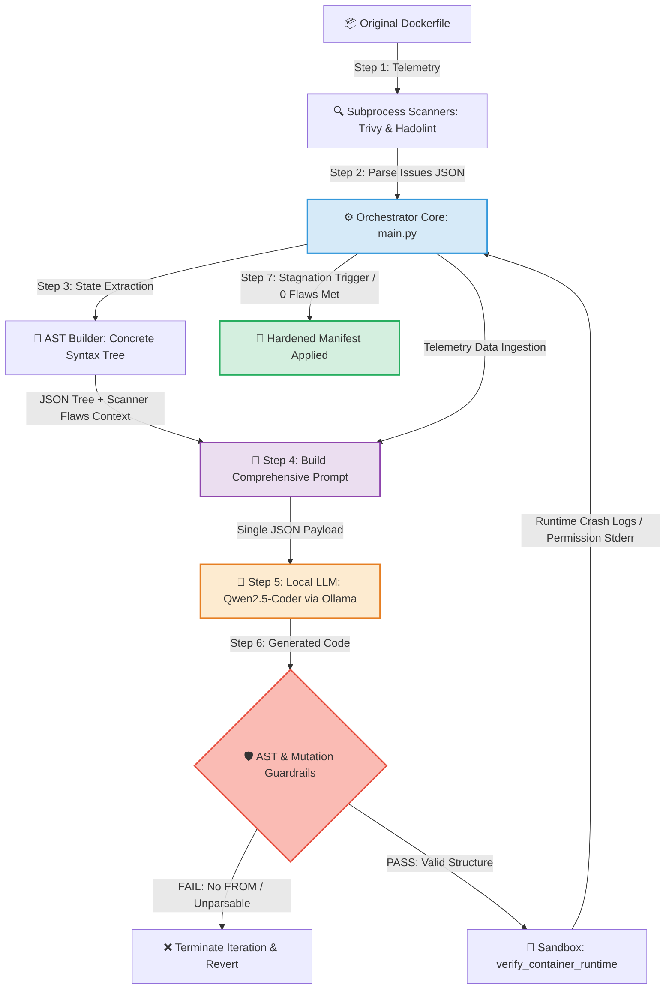

<hr style="border: 0; height: 3px; background: linear-gradient(to right, #3498db, #9b59b6, #e74c3c); margin: 20px 0;">

<div align="center">

# Autonomous AI-Driven DevSecOps Remediation Engine

**Hybrid Self-Healing Pipeline for Trivy & Hadolint using Localized LLMs**

[](https://github.com/cbrkrtek/ai-devsecops-auto-remediation/releases)[](https://www.docker.com/)
[](https://github.com/aquasecurity/trivy)

<p align="center">
  This project bridges the gap between vulnerability detection and instant mitigation. Built completely from scratch, it intercepts security scan reports, analyzes code context using local LLMs, and coordinates an iterative verification loop to safely patch manifests—eliminating alert fatigue without cloud leaks.
</p>

---
[The Problem](#the-problem--the-shift) • [Key Features](#-key-features) • [Quick Start](#-quick-start-local-installation) • [CLI Demo](#how-it-looks-real-world-cli-demo) • [Architecture](#%EF%B8%8F-architecture-flow) • [Enterprise Readiness](#-enterprise-readiness) • [Roadmap](#%EF%B8%8F-strategic-roadmap)

</div>

<hr style="border: 0; height: 3px; background: linear-gradient(to right, #3498db, #9b59b6, #e74c3c); margin: 20px 0;">


## The Problem & The Shift

Traditional DevSecOps scanners (**Trivy, Hadolint**) are great at *finding* flaws but terrible at *fixing* them. Security teams are overwhelmed by **Alert Fatigue**, while developers waste engineering hours manually bumping base images and rewriting manifests.

> **The Philosophy:** Shift-Left is dead if it only means shifting the blame to developers. This engine introduces an **Autonomous Remediation Framework** written from scratch—don't just scan it, heal it.

---

## ⚡ Key Features

* **Zero-Framework Orchestrator:** No bloated LLM wrappers (no LangChain, no CrewAI). Built fully from scratch in pure Python for absolute data provenance and execution speed.
* **Iterative Loop Control:** Implements a deterministic `while` loop mechanism protecting the pipeline from AI deadlocks and infinite generation cycles.
* **Local-First AI Execution:** 100% data privacy. Works entirely offline with localized LLMs via `Ollama` (**Qwen2.5-Coder:7b**), ensuring zero code telemetry leaks to public cloud APIs.
* **Runtime Verification & Stagnation Tracking:** Spawns automated container dry-runs in an isolated sandbox, analyzing runtime logs against static security scan differentials.
* **Abstract Syntax Tree (AST) Guardrails:** Converts mutated Dockerfiles into structured JSON syntax trees to programmatically verify structural integrity and prevent base-image extraction or structural corruption.
* **Dual-Validation Engine:** Combines standard industry scanners (Trivy/Hadolint) with custom chronological regex-parsing to catch micro-architectural flaws (e.g., switching to a non-root USER before that user is actually created in a RUN layer).

---

## 🚀 Quick Start (Local Installation)

### 1. Install Prerequisites
Make sure you have the following security tools and environment packages installed locally:
* **Trivy CLI:** Install the official [Trivy Scan Tool](https://aquasecurity.github.io/trivy/).
* **Hadolint:** Container linter tool.
* **Ollama:** Download and install it from [Ollama Official Website](https://ollama.com/).

### 2. Run the Local LLM
Pull the state-of-the-art model optimized for code and infrastructure refactoring:
```bash
ollama run qwen2.5-coder:7b
```

### 3. Clone and Run the Application
Clone this repository, place your target `vulnerable.Dockerfile` inside the root directory, and trigger the execution core:

```
git clone [https://github.com/cbrkrtek/ai-devsecops-auto-remediation.git](https://github.com/cbrkrtek/ai-devsecops-auto-remediation.git)
cd ai-devsecops-auto-remediation

# Trigger the orchestrator pipeline
python main.py
```

## 💻 How It Looks (Real-World CLI Demo)

Here is the actual execution log of the framework. It showcases the closed-loop engine processing a `Dockerfile`, dynamically resolving security vulnerabilities and linter alerts step-by-step, and breaking the loop safely via the **Stagnation Guardrail**:
```
PS D:\my-project-ai> python main.py
🌀 Loop Step #1...
  🛡️  Current issues: 4 (Trivy: 2, Linter: 2)
      👉 Target issues IDs to fix: ['DS-0002', 'DS-0029', 'DL3002', 'DL3008']
  🧪 Running sandbox runtime execution test...
  
  🌀 Loop Step #2...
  🛡️  Current issues: 1 (Trivy: 0, Linter: 1)
  ⚠️ Static Structural Issues Found:
     Line 14: Chronological violation! USER 'appuser' used before creation.
  🧪 Running sandbox runtime execution test...
```

## 🏗️ Architecture Flow
The workflow relies on a strict hybrid verification cycle where the Python core acts as a rigid barrier, controlling the flexible nature of the local LLM:


## 📈 Enterprise Readiness

| Capability | Standard AI Wrappers | Our Framework Approach |
| :--- | :--- | :--- |
| **Data Privacy** | Sends private infrastructure code to public cloud APIs | **100% Air-Gapped** via Local LLM Mesh (Ollama) |
| **Orchestration Layer** | Heavy third-party frameworks (LangChain/CrewAI) | **Zero-Dependency Core** written completely from scratch |
| **Execution Loop** | Blindly trusts the first output or gets stuck | **Strict `while` Limit Guardrails** with stagnation counters |
| **Verification** | Assumes the code is valid if syntax looks right | **Two-Tier Validation** (Static JSON Differential + Sandbox Runtime) |

---

## 🗺️ Strategic Roadmap

### 🟢 May 2026: Local Remediation Core & Pipeline Foundations (Completed)
- [x] **Greenfield Architecture:** Designed and coded the main orchestrator (`main.py`, `scanner.py`, `client.py`) entirely from scratch with zero heavy LLM frameworks.
- [x] **Multi-Scanner Ingestion:** Integrated native subprocess execution for both **Trivy** (security) and **Hadolint** (linting).
- [x] **Dockerfile AST Structural Mapping:** Implemented a concrete syntax tree parser (`ast_builder.py`) to break down mutations and safeguard core instructions like `FROM`.
- [x] **Stagnation-Based Loop Termination:** Implemented loop-breaking heuristics to intercept runtime deadlocks when models resolve 100% of static vulnerabilities but stall on runtime app logs.
- [x] **Sandbox Telemetry Isolation:** Built real-time container dry-run execution layers (`sandbox.py`) to catch runtime crashes and permission issues.

### 🟢 June 2026: Yandex Cloud Migration, Heavy Model Scaling & AST Differential Verification
- [ ] **Cloud-Native GPU Infrastructure:** Deploy a high-performance **Yandex Compute Cloud** instance equipped with an **NVIDIA V100 (32 GB VRAM)** GPU accelerator inside an isolated VPC perimeter.
- [ ] **Production LLM Upscaling:** Migrate the core inference engine from local `7B` models to the state-of-the-art **Qwen2.5-Coder:32b-Instruct** to resolve multi-layered non-root POSIX filesystem permissions and complex web server port mapping.
- [ ] **Deterministic State Comparison Engine:** Develop `core/ast_comparator.py` to mathematically compute the Semantic Diff between pre-remediation and post-remediation syntax trees.
- [ ] **Anti-Injection & Erasure Guardrails:** Implement programmatic AST interceptors to immediately reject any payload where the LLM attempts unauthorized command injections (e.g., rogue `curl`/`wget` scripts) or accidentally erases vital application build layers.
- [ ] **Context Window Hygiene via JSON-Schema:** Restructure telemetry ingestion to strip verbose scanner metadata, passing flat, structured JSON schemas to optimize token economy and inference speed.

### 🟢 July 2026: Microservice Containerization & Native GitOps Integration
- [ ] **Secure Agent Containerization:** Package the orchestrator engine into a hardened, minimal Docker image following strict non-root execution targets to prevent supply-chain vulnerabilities.
- [ ] **Yandex Container Registry Deployment:** Establish automated image build and push flows to secure enterprise cloud registries inside Yandex Cloud.
- [ ] **Automated GitOps Webhooks:** Integrate with **Yandex Managed Service for GitLab / GitHub** to trigger autonomous remediation pipelines on every new commit, automatically generating Pull Requests with embedded markdown vulnerability closure reports.
- [ ] **Infrastructure-as-Code (IaC) Repair Expansion:** Extend the structural AST engine to support `Checkov` or HashiCorp Terraform (`HCL`) telemetry configuration trees.

### 🟢 August 2026: Empirical Benchmarking & Academic Publication Readiness
- [ ] **Controlled Validation Dataset (50+ Manifests):** Curate a diverse enterprise benchmark dataset of vulnerable Dockerfiles across multiple domains (Web Servers, Backend Runtimes, Data Heavy Science stacks).
- [ ] **Comparative Scaling Evaluation:** Execute rigorous stress-tests comparing local `7B` inference against cloud-hosted `32B` acceleration to map remediation success rates, loop iteration depth, and runtime deadlock probability.
- [ ] **AST Deflector Verification:** Formally test the programmatic AST-Comparator by injecting synthetic prompt anomalies and benchmarking the engine's deterministic mitigation rate.
- [ ] **Academic Manuscript Drafting (IMRAD Standard):** Structure and write a formal computer science research paper mapping the project's zero-framework orchestration architecture, empirical cloud benchmarks, and mathematical validation layers for submission to peer-reviewed journals (VAK/RSCI).
---

## 📄 License
Distributed under the Apache 2.0 License. See `LICENSE` for more information.

## ⚠️ Disclaimer
This project is an experimental, AI-driven automation tool. Autonomous code remediation carries inherent risks of code modification errors or syntax breakdown. **Always thoroughly review and test all AI-generated files in a staging/sandbox environment before deploying to production.** The author carries zero responsibility for infrastructure damage, security regressions, or production downtime.
